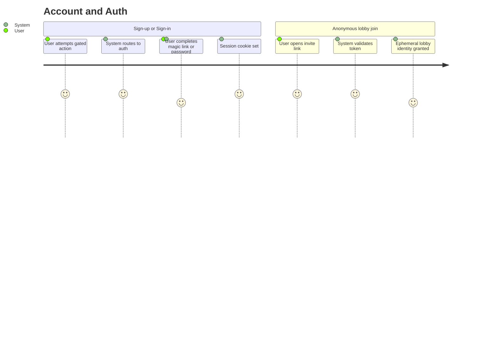

# Summary

Goob-toob runs minimal identity. Accounts are required for **uploading** (CUJ-001) and **creating lobbies** (CUJ-003). Solo viewing (CUJ-002) is anonymous. Joining a lobby (CUJ-004) is anonymous via an invite token (the link itself, in the simplest case). Auth is intentionally not the differentiator — it should be small, robust, self-host friendly, and out of the way.

# Persona

- Primary actor: **User** in any role — creator, host, joiner, or solo viewer.
- Goal: Get the right level of identity for the action they're about to take, with as little friction as the action allows.
- Context: First-time sign-up, returning sign-in, or following an action that requires identity.

# Trigger

One of:

1. User attempts an action that's gated on auth (e.g., upload, create lobby).
2. User explicitly clicks Sign-up or Sign-in.
3. User opens a lobby invite link (anonymous-via-token path).

# Preconditions

1. Auth service is reachable.
2. For sign-up: outbound email (SMTP) is configured, **OR** the deployment is in admin-bootstrapped mode where accounts are provisioned out-of-band.

# Journey Steps

## Path A — Sign-up

1. User picks Sign-up.
2. User provides an email and a username.
3. System sends a magic-link confirmation to the email (or, if password mode is enabled, the user sets a password during sign-up).
4. User completes confirmation; account is created; session cookie is established.
5. User is returned to their pre-auth destination.

## Path B — Sign-in

1. User picks Sign-in.
2. User enters their email; receives a magic link, OR enters credentials.
3. Session cookie is established on success.
4. User is returned to their pre-auth destination.

## Path C — Anonymous lobby join

1. User opens a lobby invite link.
2. System validates the lobby join token (the link, in the link-is-the-token model).
3. User is granted an ephemeral lobby-only identity (no account, no persistent record beyond the lobby's lifetime).
4. User flows into CUJ-004.

# Alternate / Failure Paths

1. **Email already in use** during sign-up. Friendly "sign in instead" path with a one-click link to the sign-in flow.
2. **Magic link expired.** Re-issue path; old link is single-use and invalidated on use.
3. **Wrong password** (in password mode). Bounded retry, then a short cooldown; no enumeration leaks (same response shape on wrong password vs unknown email).
4. **Auth service unreachable.** Existing sessions keep working for read-only browse paths. New sign-ins blocked with a clear operator-level error and a friendly user-facing retry.
5. **Self-host without SMTP** (no magic link possible). Admin-bootstrapped mode is the supported path — see Resolved Decisions.
6. **Anonymous lobby joiner without a token** for a private lobby. 403 with a clear reason; no enumeration of valid tokens.
7. **Token reuse / sharing of invite links** beyond intended audience. Acceptable in v1 — link is the token by design. Operator-level rate-limits on a per-link basis prevent runaway sharing damage.

# Success Outcome

Each role has the minimum identity it needs:

- Solo viewers: anonymous.
- Lobby joiners: ephemeral lobby-only identity via invite token.
- Creators and lobby hosts: real account, sessioned.

Self-hosters can run with email/SMTP, with passwords, or with admin-bootstrapped accounts only — each configuration is supported and documented.

# Metrics

- **Success metric.** Sign-in success rate.
- **Guardrail metric.** Failed-auth rate (brute-force signal).
- **Guardrail metric.** Magic-link delivery latency / failure rate (deliverability signal).
- **Guardrail metric.** Session-duration distribution and re-auth frequency (informs TTL).

# Mermaid Journey Diagram

# Resolved Decisions

1. **Auth shape.** Magic-link is the default. Optional password mode for self-host deployments without SMTP. Operators choose at deploy time. _(Resolved 2026-05-02.)_
2. **Admin-bootstrapped accounts.** Self-host deployments without SMTP can ship in admin-bootstrap mode: a CLI command on the API container creates the first account out-of-band. Account self-service can be disabled entirely. _(Resolved 2026-05-02.)_
3. **Anonymous viewing of public videos.** Allowed. No account required to watch a public video solo. Confirms with CUJ-002. _(Resolved 2026-05-02.)_

# Open Questions

1. **Federation / OIDC support.** v1 or punted? Lean: punted with hooks; self-host first, federation later.
2. **Session TTL and refresh policy.** Idle timeout, absolute timeout, refresh-on-activity?
3. **Rate-limit policy for sign-up endpoints** (deliverability + abuse).
4. **Account deletion / data export.** v1 or punted? Self-host context softens the urgency, but the right-to-delete should still exist.

# Approval

- Approval Status: approved
- Approved By: nathan
- Approved On: 2026-05-02
- Notes: Approved alongside CUJs 1-6 in a single batch.
