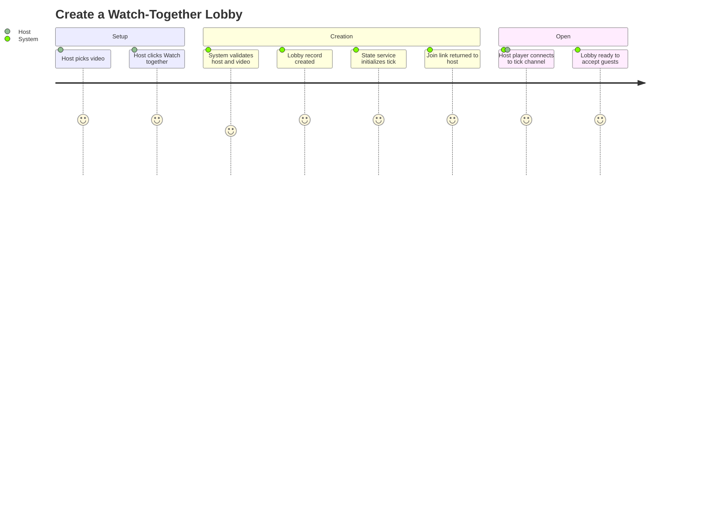

# Summary

A logged-in user (the **host**) creates an ephemeral watch-together lobby anchored to a specific video, receives a shareable join link, and becomes the canonical playback authority for that lobby's lifetime. The lobby exists only as long as it's needed — no persistent room state.

# Persona

- Primary actor: **Host** — an authenticated user with lobby-creation privileges.
- Goal: Set up a lobby so they can watch a video synchronously with friends.
- Context: After picking a video they want to share, before guests arrive.

# Trigger

Host clicks "Watch together" on a video page (or any equivalent entry point that names the video).

# Preconditions

1. Host is authenticated.
2. Target video is in the `ready` state (CUJ-001 completed for it).
3. The lobby state service is reachable from the API.
4. Host is under the concurrent-lobby cap for their account.

# Journey Steps

1. Host clicks "Watch together" on the video page.
2. System validates host eligibility and video readiness.
3. System creates an ephemeral lobby record with a unique join code and an opaque internal id.
4. The lobby state service initializes the room with `{video_id, playhead: 0, paused: true, host_id}`.
5. System returns a shareable URL of the form `https://<host>/lobby/<join-code>` to the host.
6. Host's player connects to the lobby tick channel; the lobby is now `open`.
7. Host can pre-buffer the video while waiting for guests; pre-buffer does not advance the authoritative playhead.

# Alternate / Failure Paths

1. **Video transitions out of `ready` mid-creation.** Creation fails with an actionable error; no orphan lobby record left behind.
2. **User not authenticated.** Redirect into the auth flow (CUJ-007), return to lobby creation after.
3. **Lobby state service unreachable.** Creation fails fast with an operator-level error logged and a retry-friendly message to the user. No half-created lobby.
4. **Concurrent-lobby cap exceeded.** Rejection cites the cap and which existing lobby would need to end first.
5. **Host abandons before any guest joins.** Empty-lobby idle timeout fires (see CUJ-006); lobby auto-tears down.

# Success Outcome

A lobby URL exists, the host's player is wired to the tick channel as the authoritative source of truth, and the lobby is ready to accept joiners. No persistent record of the lobby beyond its runtime state and minimal audit metadata.

# Metrics

- **Success metric.** Lobby-creation success rate (attempted creates that reach `open`).
- **Guardrail metric.** Median time from "Watch together" click to lobby `open`.
- **Guardrail metric.** Idle-abandoned lobbies / total created — informs idle-timeout tuning.
- **Guardrail metric.** Concurrent-lobby cap hit rate per host.

# Mermaid Journey Diagram

# Resolved Decisions

1. **Lobby visibility — link is the token.** Anyone with the lobby URL can join an `open` lobby. There is no separate access-control gate; the URL itself is the credential. Operators may rate-limit per-link to bound runaway sharing. _(Resolved 2026-05-02.)_

# Open Questions

1. **Lobby identifier shape.** Short shareable code (memorable, share-friendly) plus an opaque UUID under the hood — confirm.
2. **Concurrent-lobby cap per host.** What's the v1 limit, and is it configurable per-account?
3. **Lobby lifetime ceiling.** Should there be a hard maximum lobby duration regardless of activity (e.g., 24 h)?
4. **Pre-fill behavior.** Host arrives paused at `playhead: 0`, or auto-starts? Lean: paused. Host hits play when the room is ready.

# Approval

- Approval Status: approved
- Approved By: nathan
- Approved On: 2026-05-02
- Notes: Approved alongside CUJs 1-2, 4-7 in a single batch.
