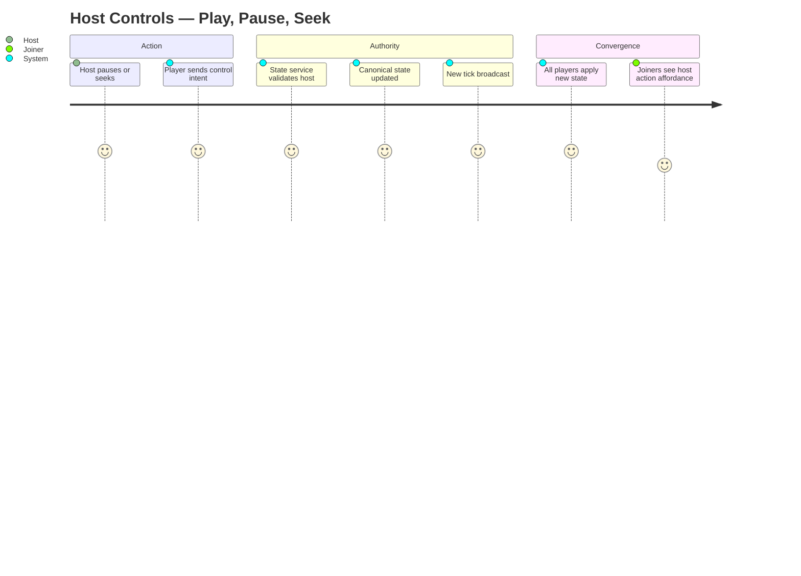

# Summary

Only the host can pause, resume, or seek the lobby's playback. Their control intent flows through the lobby state service, which validates and broadcasts a new authoritative tick. All participants converge on the new state within a small fixed time. Non-hosts cannot move the room; they can only consume.

The **host role is transferable**. If the current host disconnects past the grace window, a successor is elected automatically (see CUJ-006). Throughout this CUJ, "host" means whoever currently holds the role — not the original creator of the lobby.

# Persona

- Primary actor: **Host** — currently holds the host role for this lobby (originally creator, or successor via election).
- Goal: Control communal playback (pause to discuss, seek back to a moment, resume after a break).
- Context: An active lobby session, with or without joiners present.

# Trigger

Host hits play, pause, or seek in their player UI (or via keyboard shortcut).

# Preconditions

1. Lobby is `open`.
2. Host is connected to the tick channel and authenticated as the lobby's current `host_id`.
3. Lobby state service is reachable.

# Journey Steps

1. Host clicks pause (or play, or seeks to a position).
2. The player intercepts the action, suppresses the local-only effect, and emits a control intent (`{kind: pause | play | seek, target_playhead, requested_at}`) to the lobby state service.
3. State service authenticates the intent against the lobby's current `host_id`, applies it to the canonical room state, and emits a new tick to all subscribers.
4. All participants' players receive the new tick and converge:
   - **Pause:** all players freeze at the broadcast playhead.
   - **Play:** all players resume from the broadcast playhead at the broadcast wall-clock.
   - **Seek:** all players snap to the new playhead, re-buffer if needed, then resume.
5. Host UI shows confirmation. Joiners see a small affordance ("host paused", "host seeked to mm:ss") for a few seconds after.

# Alternate / Failure Paths

1. **Non-host attempts to pause / seek.** Action is suppressed locally; no intent is sent. Their UI shows a brief "host controls playback" hint.
2. **State service unreachable when the host issues a control.** Host UI shows a transient warning. The intent is retried with backoff. The lobby's last-known tick remains the authoritative state until the channel is restored. No phantom state.
3. **Host disconnects mid-control.** Host-loss handling in CUJ-006 takes over (grace window, then election if needed). In-flight controls are not retried by the new host; the room continues from the last successfully-applied tick.
4. **Network jitter on the broadcast.** Tick is idempotent (it states the truth, not a delta), so participants converge on retransmit without manual recovery logic.
5. **Rapid-fire control events** (host scrubbing). State service coalesces events per-host with a short debounce so joiners don't see seek-thrash.

# Success Outcome

All participants are paused, playing, or seeked together within a small fixed time after the host's action — regardless of room size or joiners' network quality. Non-host actions cannot move the room.

# Metrics

- **Success metric.** Control-propagation latency P50 / P95 (host action → all participants converged).
- **Guardrail metric.** Unauthorized-control attempt rate (signals out-of-spec or malicious clients).
- **Guardrail metric.** Control retry rate (signals state-service health).
- **Guardrail metric.** Coalesced-events rate during scrubbing (validates the debounce is working).

# Mermaid Journey Diagram

# Resolved Decisions

1. **Per-participant local pause is explicitly NOT supported in v1.** A forked playback isn't a watch-together; participants who need to step away may simply leave the lobby. _(Resolved 2026-05-02.)_
2. **Host role is transferable via election.** Mechanics defined in CUJ-006. The "host" in this CUJ is always the lobby's current `host_id`, not the original creator. _(Resolved 2026-05-02.)_

# Open Questions

1. **Co-host / explicit conch-passing.** v1.5 unless wanted day-one. (Election in CUJ-006 covers involuntary handoff; this would be voluntary.)
2. **Visual affordance when host pauses.** Room-wide overlay vs subtle indicator? Affects feel.
3. **Seek granularity.** Frame-accurate, or to nearest segment boundary? Lean: nearest segment boundary — cheaper, DASH-aligned.
4. **Scrub debounce window.** 200 ms? 500 ms? Trade-off between snappy seeks and joiner thrash.

# Approval

- Approval Status: approved
- Approved By: nathan
- Approved On: 2026-05-02
- Notes: Approved alongside CUJs 1-4, 6-7 in a single batch. Host role transferability via election (CUJ-006) folded in.
