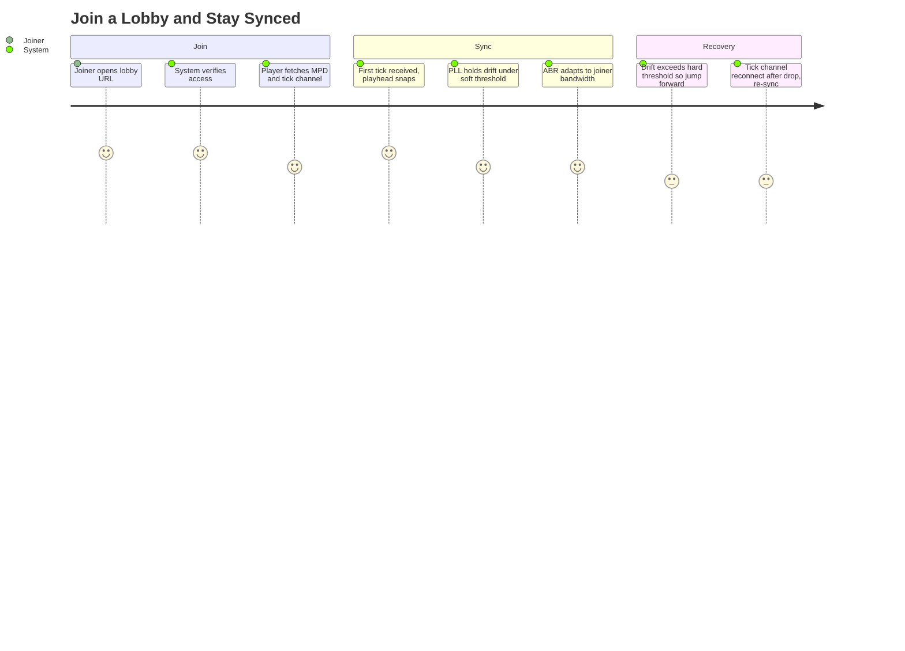

# Summary

A viewer follows a lobby join link, their player connects to the lobby's authoritative tick channel, snaps to the canonical playhead, and stays synchronized with the host and other joiners for the duration of the session. A joiner with degraded bandwidth drops to lower DASH renditions or jumps forward to catch up — they never feed back-pressure into the lobby and never delay the room.

This is the journey that proves the watch-together value proposition. The sync model (one-way authoritative tick, no consensus) is what makes the "no slow user holds the rest back" constraint achievable.

# Persona

- Primary actor: **Joiner** — authenticated, OR anonymous via an invite token.
- Goal: Watch a video in sync with a host and other joiners.
- Context: Followed a shared lobby link from chat / DM / etc.

# Trigger

Joiner opens a lobby URL.

# Preconditions

1. Lobby exists and is `open` (host is connected).
2. The video the lobby is anchored to is in the `ready` state.
3. Joiner's browser supports Media Source Extensions.
4. Joiner has the access token (link itself, or an explicit token, depending on lobby visibility).

# Journey Steps

1. Joiner opens the lobby URL.
2. System verifies the lobby is `open` and the access token is valid.
3. Joiner's player fetches the DASH MPD manifest and connects to the lobby tick channel over WebSocket.
4. On the first tick received, the player computes its target playhead as `tick.playhead + (now − tick.wall_clock)` and snaps to it (with a small grace buffer).
5. Player begins playback in lock-step with the authoritative tick.
6. The player's PLL holds drift inside the soft threshold (250 ms) while ABR maintains the highest sustainable rendition.
7. If the joiner's bandwidth can't sustain the current rendition, ABR drops them to a lower one — drift remains bounded, the room is undisturbed.
8. If joiner drift exceeds the hard threshold (2 s, lagging) — for example, a long buffer stall — the player jumps forward to the authoritative position rather than chase asymptotically.

# Alternate / Failure Paths

1. **Lobby has been torn down.** Joiner sees a clean "lobby ended" page, not a broken connection.
2. **Lobby is private and the access token is missing or invalid.** 403 with a friendly explanation.
3. **Tick-channel disconnect mid-session.** Exponential-backoff reconnect; the player keeps playing best-effort against the last-known tick state until the channel is restored, then re-syncs.
4. **Sustained connection too poor for even the lowest rendition.** Joiner sees a "your connection cannot keep up" notice; they may remain in the room for chat / presence (deferred) without active playback.
5. **Race: joiner arrives at the moment the host pauses.** The first tick carries `paused: true`; the player respects it and starts paused.
6. **Clock skew between joiner and server.** Server tick includes its own wall clock; joiner uses local clock only for inter-tick interpolation, never for absolute alignment.

# Success Outcome

The joiner is watching the same video as the host, holding within 250 ms drift under stable network, with bitrate that adapts cleanly to their network conditions. Their experience never affects another participant's experience.

# Metrics

- **Success metric.** % of joins reaching steady-state sync within the target time-to-sync.
- **Guardrail metric.** P50 and P95 drift across all participants in a session.
- **Guardrail metric.** Forced-jump rate (jump events per minute per joiner) — high values signal an undersized rendition ladder or aggressive thresholds.
- **Guardrail metric.** Average rendition-delta between joiner and host — diagnostic for ABR strategy.
- **Guardrail metric.** Successful reconnect rate after a tick-channel drop.

# Mermaid Journey Diagram

# Resolved Decisions

1. **Soft drift threshold (PLL).** 250 ms — the player's local PLL holds joiner playhead within this band of authoritative tick. _(Resolved 2026-05-02.)_
2. **Hard drift threshold (jump-forward).** 2 s — sustained drift beyond this band triggers a snap-forward to the authoritative position. _(Resolved 2026-05-02.)_
3. **Anonymous-via-link joiners.** Anonymous joiners are allowed via the lobby invite link (the link is the token). Confirms with CUJ-003 lobby-visibility decision and CUJ-007 identity model. _(Resolved 2026-05-02.)_
4. **Tick frequency.** 1 Hz steady-state; bursts to 4 Hz for ~5 s after any host control event. Keeps idle bandwidth low while making post-seek/pause re-sync responsive. _(Resolved 2026-05-02.)_

# Open Questions

1. **Concurrent-joiner cap per lobby.** v1 default and operator override.

# Approval

- Approval Status: approved
- Approved By: nathan
- Approved On: 2026-05-02
- Notes: Approved alongside CUJs 1-3, 5-7 in a single batch.
