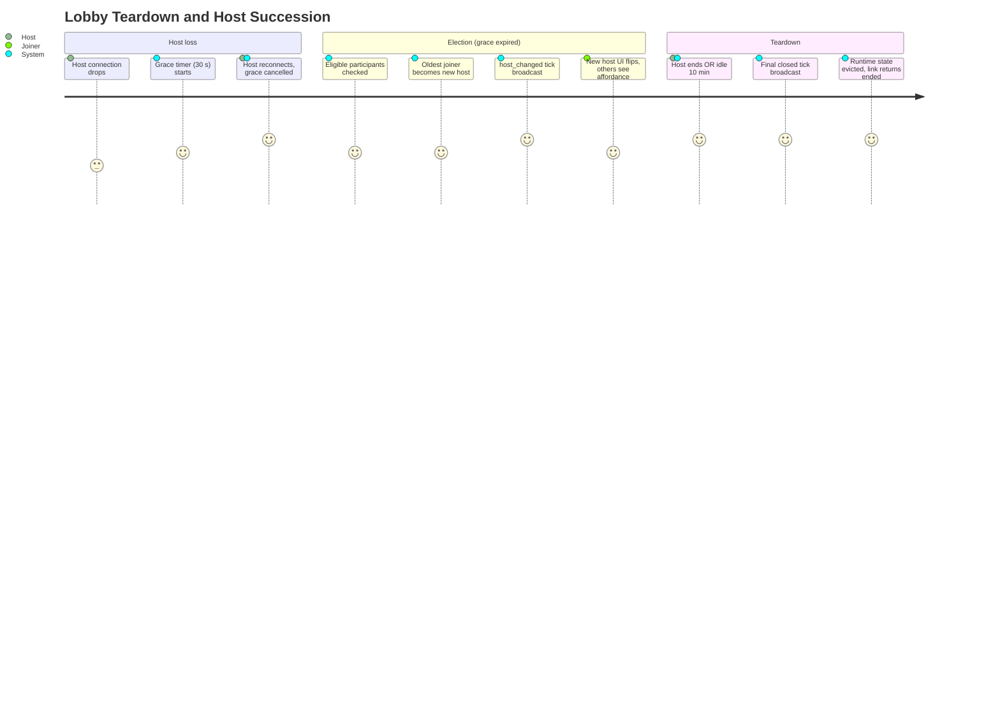

# Summary

A lobby ends when (a) the current host explicitly closes it, OR (b) the lobby has been empty long enough for the idle timeout to fire. A host's network drop, by itself, **no longer ends the lobby** — instead, the lobby attempts to elect a successor host from remaining participants. Teardown only happens when the room is genuinely empty for the idle window, or when the current host explicitly ends the room.

When teardown does happen, all connected participants are notified, runtime state is evicted, the join link stops admitting anyone, and no persistent record beyond minimal audit metadata remains. The "ephemeral" promise of the watch-together model lives or dies in this CUJ.

# Persona

- Primary actors:
  - **Host** (explicit teardown).
  - **System** (idle teardown, host-loss grace, election).
  - **Surviving participants** (involuntary recipients of host succession).
- Goal: End the watch session cleanly with no leftover state, OR keep the session alive when the original host drops out.
- Context: Mid-session host departure, end of a watch session, or extended idle.

# Trigger

Any one of:

1. **Explicit:** Current host clicks "End lobby."
2. **Idle:** All participants have been disconnected long enough for the empty-lobby idle timeout to fire.
3. **Host loss:** Current host's tick-channel connection is lost. Triggers the host-succession sub-flow (Path A below). Only escalates to teardown if no eligible successor remains.

# Preconditions

1. Lobby is currently `open` (or in a transient state derived from `open`).
2. Lobby state service is reachable from the eviction path. (Crash recovery covers the unreachable case — see failure paths.)

# Journey Steps

## Path A — Host Succession via Election (host loss with surviving participants)

1. Current host's tick-channel connection drops.
2. State service starts a 30 s grace timer.
3. **If host reconnects inside the grace window:** timer is cancelled, normal operation resumes. No participant-visible event.
4. **If grace expires AND ≥ 1 eligible participant remains:** election fires.
5. State service deterministically picks the participant with the earliest join timestamp as the new host. Anonymous-token joiners are eligible electees on equal footing with authenticated joiners.
6. State service updates `host_id` in the canonical lobby state and emits a `host_changed` tick to all subscribers.
7. New host's UI flips to show host controls. Other participants see a brief "host changed" affordance.
8. Lobby continues normally with the new host. The original host, if they later return, is treated as a regular joiner (no auto-restore of host status).

## Path B — Explicit Teardown (current host ends the lobby)

1. Current host clicks "End lobby."
2. State service marks the lobby `closing` with reason `host_ended`.
3. A final tick is broadcast on the tick channel with a `closed` marker and the reason.
4. All connected participants' players receive the closed tick and transition to a clean "lobby ended" state.
5. State service evicts the lobby's runtime state.
6. Lobby record is retained as a minimal audit row (open question — see below).
7. Subsequent requests to the lobby URL return a clean "lobby ended" page.

## Path C — Idle Teardown (no participants left, idle window passed)

1. Final participant disconnects, leaving the lobby empty (host already gone, or last joiner left after an election cascade).
2. State service starts the 10 min empty-lobby idle timer.
3. **If anyone reconnects inside the timer:** timer cancelled, normal operation resumes. (A returning original-host is just a joiner now if an election concluded; if no election ran yet, they reclaim host status.)
4. **If timer expires:** state service marks lobby `closing` with reason `idle`, broadcasts the closed tick, evicts runtime state. Same outcome as Path B steps 3-7.

# Alternate / Failure Paths

1. **Original host returns after election concluded.** Treated as a regular joiner. Their player drops host UI. Acceptable in v1; explicit conch-pass back to the original is a v1.5 concern.
2. **Newly-elected host immediately disconnects.** Cascading election: another grace timer starts; oldest remaining participant becomes host. Cascades are rate-limited — more than 3 elections within 60 s for the same lobby triggers forced teardown to prevent thrash.
3. **Election fires with zero eligible participants** (e.g., host dropped, last joiner dropped at the same instant). Falls through to Path C (idle timer).
4. **State service crash mid-sequence.** On restart, an orphan-eviction sweep reconciles state: any lobby in `closing` for more than a small bound is hard-evicted; any lobby with no recent host heartbeat AND surviving joiners runs election from join timestamps; any lobby with no participants for ≥ 10 min is torn down.
5. **Multiple teardown triggers fire simultaneously.** First-to-land wins; subsequent triggers are no-ops with logged reasons.
6. **Participants miss the final tick** (network drop). Their next reconnect attempt resolves to "ended" via the persisted lobby record, not a stale connection.
7. **Underlying video deleted mid-session.** Open question — see below.
8. **Force-close path** for moderation. Open question — see below.

# Success Outcome

- The host role survives transient host disconnects and outright host departure as long as anyone else is in the room.
- When the room is genuinely empty for the idle window, OR the current host explicitly ends, the lobby tears down cleanly: zero background work, zero memory, no admit-able link.
- All participants experience clean transitions — to a new host, or to an ended state — never to a hung or zombie lobby.

# Metrics

- **Success metric.** Election success rate (host losses with ≥ 1 participant remaining that successfully transition to a new host).
- **Success metric.** Clean-teardown rate (terminations that leave zero orphans).
- **Guardrail metric.** Cascade-election rate per lobby (signal that something else is wrong, e.g. systemic network issue).
- **Guardrail metric.** Orphan-eviction sweep volume (state-service hygiene signal — should trend toward zero).
- **Guardrail metric.** Median time from host-loss trigger to either reclaim or election complete.
- **Guardrail metric.** Premature-election rate (host disconnects that crossed the grace window but were transient — informs grace-period tuning).

# Mermaid Journey Diagram

# Resolved Decisions

1. **Host-disconnect grace period.** 30 s. On expiry, host succession via election fires — **not** teardown. _(Resolved 2026-05-02.)_
2. **Empty-lobby idle timeout.** 10 min from last participant disconnect. _(Resolved 2026-05-02.)_
3. **Host succession mechanism.** Deterministic election by oldest-join timestamp. State service is the elector. _(Resolved 2026-05-02.)_
4. **Cascade election rate-limit.** More than 3 elections in 60 s for the same lobby forces teardown to prevent thrash. _(Resolved 2026-05-02.)_
5. **Original host's status post-election.** Treated as a regular joiner if they return after election concluded. No auto-reinstatement. _(Resolved 2026-05-02.)_
6. **Anonymous-token joiners are eligible electees.** Election treats anonymous joiners equally with authenticated joiners. The link-is-the-token model already grants a stable per-session identity, so handing them host controls is no scarier than letting them join. Keeps elections from collapsing into teardown when only anonymous viewers remain. _(Resolved 2026-05-02.)_

# Open Questions

1. **Audit retention policy.** Zero record after teardown, or a minimal audit row (host id, video id, started/ended timestamps, peak participants, election count)? Lean: minimal audit row — useful for abuse handling, low cost.
2. **Force-close path for moderation.** Should an operator be able to kill any lobby (regardless of host)? Lean: yes, behind admin auth.
3. **Underlying video deleted mid-session.** Treat as `forced_end` with a clear reason in the closed tick, or finish the current session and only block new joins?
4. **Visible election affordance to participants.** Subtle banner, room-wide overlay, no UI change at all? Affects the feel of the handoff.

# Approval

- Approval Status: approved
- Approved By: nathan
- Approved On: 2026-05-02
- Notes: Approved alongside CUJs 1-5, 7. Election mechanic added per Nathan's structural request during the cross-cut review.
