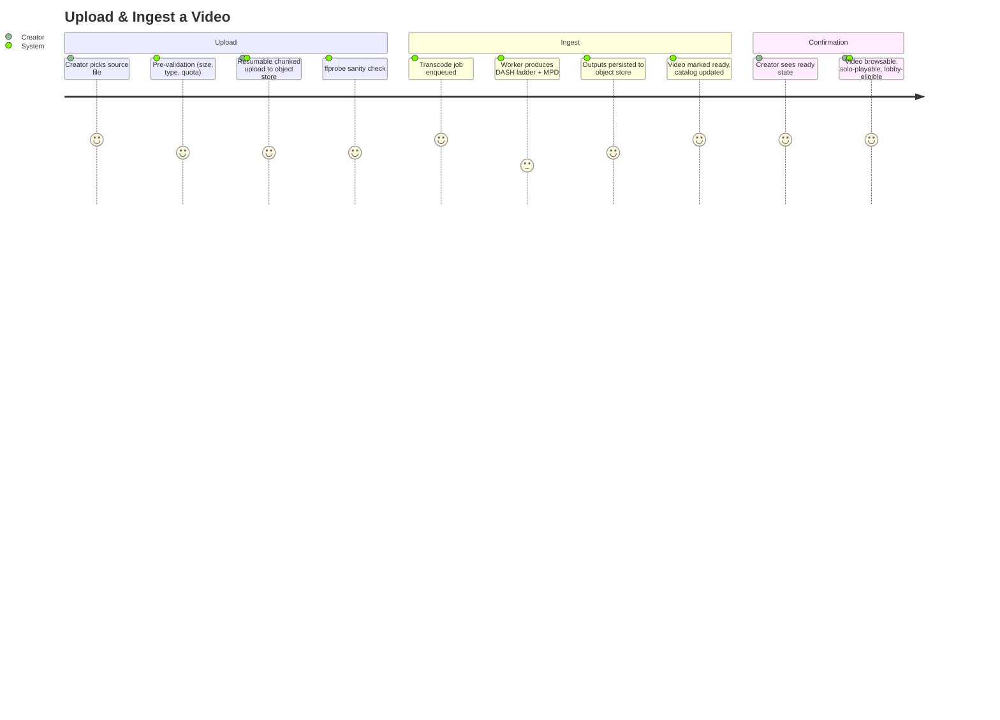

# Summary

A creator places a finished video file on goob-toob such that any future viewer — solo or in a watch-together lobby — can stream it adaptively, with no transcoding work happening at watch time. All transcode work is done once, ahead of playback, and persisted as a multi-bitrate MPEG-DASH rendition ladder.

# Persona

- Primary actor: **Creator** (an authenticated user with upload privileges).
- Goal: Make a finished video file streamable on goob-toob.
- Context: After producing the video, before anyone — including the creator — wants to watch it solo or share it in a lobby.

# Trigger

The creator has a finished video file (mp4, mkv, mov, webm, etc.) on their local machine and wants to publish it to goob-toob.

# Preconditions

1. Creator has an authenticated account with upload privileges.
2. Source file is a container/codec combination supported by the server's `ffmpeg` build.
3. The transcode worker pool has either available capacity or queue depth within bounded limits.
4. Object storage is reachable from both the API and the transcode workers.

# Journey Steps

1. Creator chooses "Upload" and selects a source file.
2. System pre-validates client-side: file size against quota, extension/MIME against the allowlist.
3. Client begins a resumable, chunked upload directly into object storage.
4. System probes the uploaded source with `ffprobe` to confirm container/codec/duration are supportable.
5. System enqueues a transcode job carrying the object-store source key, target rendition ladder, and creator metadata.
6. A transcode worker claims the job, runs `ffmpeg` to produce the rendition ladder as fragmented-MP4 segments plus an MPEG-DASH `.mpd` manifest, and writes outputs back to object storage.
7. Worker marks the video record as `ready` and the catalog index becomes aware of it.
8. Creator sees the video transition to "ready" in the UI; the video is now browsable, solo-streamable, and selectable as the source for any new watch-together lobby.

# Alternate / Failure Paths

1. **Unsupported source codec / container.** Server returns an actionable error from the `ffprobe` check before any transcode work begins. Creator is told why and what is supported.
2. **Mid-upload network drop.** Resumable upload protocol resumes from the last completed chunk; no full restart.
3. **Quota exceeded.** Upload is rejected at pre-validation with the current quota and overage shown.
4. **Transcode failure** (codec edge case, corrupt source, ffmpeg crash). Job goes to a dead-letter queue. Video stays in `failed` state. Source file is retained for diagnosis. Creator is notified with a correlation id.
5. **Worker crash mid-transcode.** Job is reclaimed by another worker after a visibility timeout. Partial outputs are cleaned up before the retry.
6. **Duplicate upload** (same content hash by same creator). System surfaces the existing video instead of re-transcoding.

# Success Outcome

The video appears in the catalog in the `ready` state and:

- Plays end-to-end via DASH adaptive bitrate in a standard browser player.
- Is selectable as the source video for any new watch-together lobby.
- Triggers zero on-demand transcode work at playback time, regardless of how many concurrent viewers it has.

# Metrics

- **Success metric.** Upload-to-ready conversion rate: percentage of upload attempts that reach `ready` state within the target SLA for their source duration.
- **Guardrail metric.** Median time-to-ready for a 10-minute, 1080p source on stock self-host hardware (single-node, CPU-only).
- **Guardrail metric.** Transcode failure rate (jobs reaching dead-letter ÷ jobs claimed).
- **Guardrail metric.** Storage amplification ratio (output ladder bytes ÷ source bytes), tracked to keep the rendition ladder honest.

# Mermaid Journey Diagram

# Resolved Decisions

1. **Rendition ladder (v1).** 360p / 720p / 1080p, with bitrates pulled from the BBC / Bitmovin reference tables. _(Resolved 2026-05-02.)_
2. **Source-file retention.** Keep originals behind a config flag, default `keep`. Insurance against re-transcoding to a future ladder; storage is cheap on self-host. _(Resolved 2026-05-02.)_
3. **Object-storage default.** Ceph via RADOS Gateway (S3-compatible). MinIO is **not** the default. _(Resolved 2026-05-02.)_
4. **Chunked upload protocol.** TUS — strongest resumability story; well-defined spec. _(Resolved 2026-05-02.)_

# Open Questions

1. **Maximum source duration and per-creator storage quota.** What are the v1 caps?
2. **Audio handling.** Single muxed audio adaptation set at one bitrate, or its own ladder?
3. **Subtitles / captions.** In v1, or punted to a later CUJ?
4. **Authentication shape for upload.** Session cookie, bearer token, signed upload URL? Converges with CUJ-007 (Account & Auth).

# Approval

- Approval Status: approved
- Approved By: nathan
- Approved On: 2026-05-02
- Notes: Approved alongside CUJs 2-7 in a single batch after Nathan reviewed the shape and answered the cross-CUJ resolution table.
