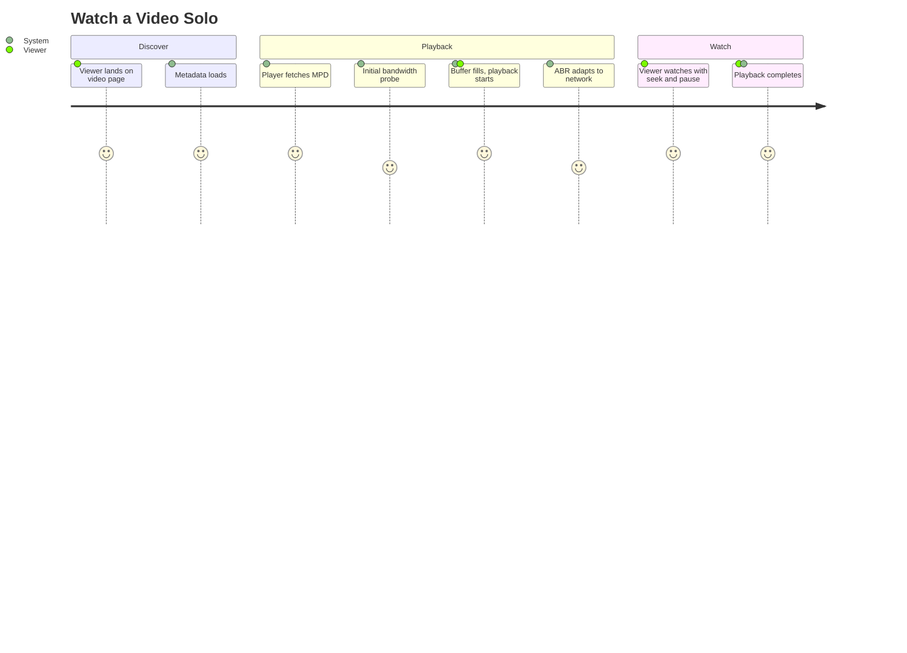

# Summary

A viewer opens a video page on goob-toob and watches the video end-to-end via MPEG-DASH adaptive bitrate. Playback uses pre-baked renditions only (no server-side transcoding at watch time) and adapts cleanly to network conditions for the duration of the session. Solo watch is the baseline that proves the streaming pipeline works before any lobby concerns are layered on top.

# Persona

- Primary actor: **Viewer** — anonymous OR authenticated; account is not required for solo watch.
- Goal: Watch a single video on goob-toob to completion.
- Context: A casual browse, a shared link, or a direct URL into a video page.

# Trigger

Viewer lands on a video page — via the catalog, an external link, or a deep URL.

# Preconditions

1. Video exists in the `ready` state (CUJ-001 successfully completed for it).
2. The DASH manifest and segment files are present in object storage and reachable from the viewer's network.
3. Viewer's browser supports Media Source Extensions (any modern Chromium / Firefox / Safari).

# Journey Steps

1. Viewer opens the video page.
2. System serves the page with metadata (title, description, duration, thumbnail).
3. The player fetches the DASH MPD manifest.
4. The player picks an initial rendition based on a first-segment bandwidth probe.
5. The player buffers and starts playback.
6. The ABR algorithm adapts rendition up and down as bandwidth fluctuates over the session.
7. Viewer watches to completion (or seeks / pauses freely throughout).

# Alternate / Failure Paths

1. **Video not in `ready` state.** Page surfaces the actual state (`processing`, `failed`, `deleted`) cleanly — no broken player or hung loader.
2. **Network drop mid-playback.** Player drains its buffer, surfaces a recoverable "reconnecting" state, recovers without a hard error from a transient drop.
3. **Browser without MSE support.** Graceful fallback page explaining the requirement; no white screen.
4. **CORS / segment delivery misconfig.** Caught loudly in dev; in prod, surfaces a clear, logged failure rather than silent stalls.
5. **Abusive throughput.** Per-session throughput is bounded (rate-limit on the segment delivery path).

# Success Outcome

The viewer watches the video at the highest sustainable bitrate their connection supports, with no rebuffer events under stable network conditions, and zero on-demand transcode work happening on the server during their session.

# Metrics

- **Success metric.** % of playback sessions completing without a rebuffer event under stable network conditions.
- **Guardrail metric.** Median time-to-first-frame after page load.
- **Guardrail metric.** Rebuffer ratio (rebuffer time ÷ total playback time).
- **Guardrail metric.** Average sustained rendition (proxy for ABR effectiveness against the available ladder).

# Mermaid Journey Diagram

# Resolved Decisions

1. **Anonymous solo watch.** No account required to watch a public video. Account is required only for upload (CUJ-001) and lobby creation (CUJ-003). _(Resolved 2026-05-02.)_

# Open Questions

1. **Persistent watch progress / resume.** Per-viewer "where I left off" — v1 or punt?
2. **Like / view counts.** Minimal counters day-one or fully punted?
3. **Recommendations / related videos.** Punt to v1.5+ unless a stub is wanted now.
4. **Captions / subtitle rendering.** Tied to CUJ-001 captions decision; defer.

# Approval

- Approval Status: approved
- Approved By: nathan
- Approved On: 2026-05-02
- Notes: Approved alongside CUJs 1, 3-7 in a single batch.
