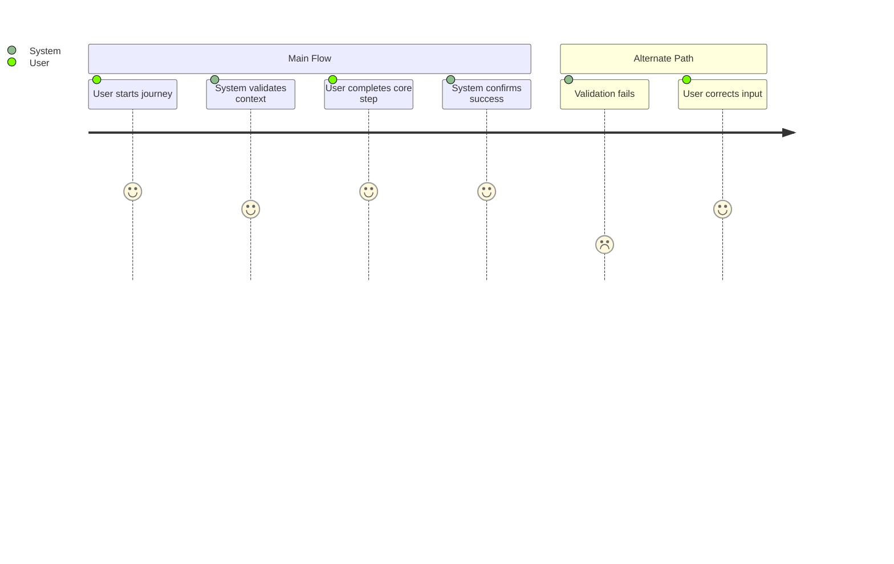

# Summary

Describe the user outcome this journey must achieve.

# Persona

- Primary actor: <who>
- Goal: <what outcome they need>
- Context: <when/where this journey occurs>

# Trigger

What starts this journey?

# Preconditions

1. <condition>
2. <condition>

# Journey Steps

1. <actor action>
2. <system response>
3. <actor action>
4. <system response>

# Alternate/Failure Paths

1. <failure case and fallback>
2. <validation issue and expected handling>

# Success Outcome

Define the user-visible outcome when the journey is complete.

# Metrics

- Success metric: <metric>
- Guardrail metric: <metric>

# Mermaid Journey Diagram

# Open Questions

1. <question>
2. <question>

# Approval

- Approval Status: pending | approved | rejected
- Approved By: <name-or-role>
- Approved On: <YYYY-MM-DD>
- Notes: <approval notes>
